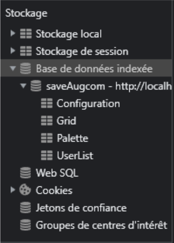

# Database tutorial

For this tutorial, I use AugCom as an example source. To see the database, right click then "inspect" or press F12. Choose Appli in the top tabs.

Then in storage unfold indexed database, and you will find the AugCom database and its different tables and their data.

the key "1" in AugCom is the default user key with all default settings (configuration, grid, color palette).

This database, if you decide to delete it from the browser, will automatically reformat itself when you refresh the AugCom application page with the default values, so you will lose all other users, grids etc...

The first thing you have to do for each operation on the database is to make an opening query like this:

## Add a table to the database

To add a table you just have to use the event to target the database then use the createObjectStore() function which is present in angular without package and indicate the name of the table here 'Palette' and put in auto-increment.

## Add/modify/delete data in a table

To add data in a table, you have to use the event to make a transaction.

Then, if you want to add a data in the table you have to use 'add' by giving the data as argument, even if 'put' works the same way, but it targets a key (here the 2nd argument is the key). If it exists, it will modify the content of this key, otherwise it adds a row with the key and the data.

To delete a line you just have to use "delete" giving as argument the key of the data to delete.
