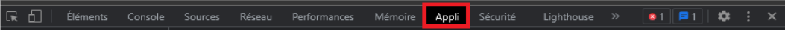
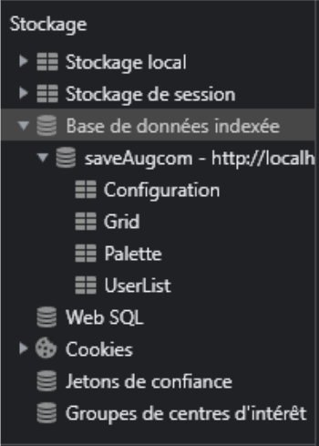
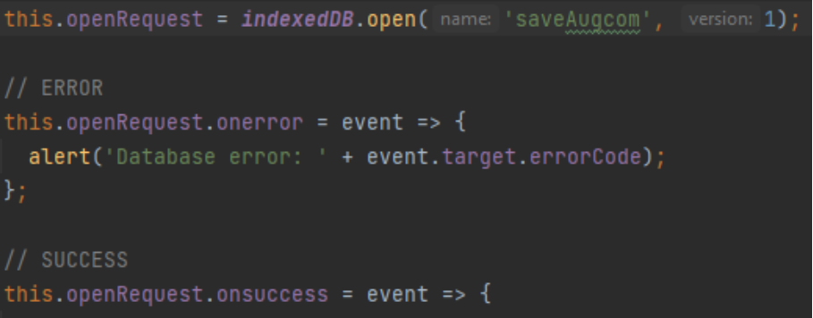
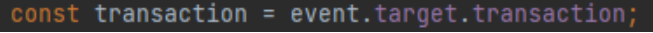
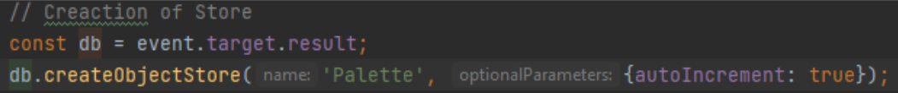
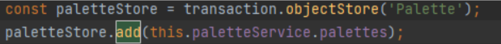
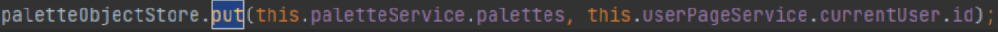

# Tutoriel base de donnée

Pour ce tuto, j’utilise AugCom comme source d’exemple. Pour voir la base de données, clique droit puis “inspecter” ou pressez F12. Choisissez Appli dans les onglets du haut.

Puis dans stockage déplier base de donnée indexée et vous y trouverez la base de données d’AugCom et ses différentes tables ainsi que leurs données.

la clé "1" dans AugCom est la clé de l’utilisateur par défaut avec toutes les paramètres par défaut (configuration, grille, palette de couleur).

Cette base de données si vous décidez de la supprimer du navigateur, se reformera automatiquement quand vous rafraichissez la page de l’application AugCom avec les valeurs par défaut, donc vous perdrez tous les autres utilisateurs, grilles etc…

La première chose qu’il va falloir faire à chaque opération sur la base de données c’est de faire une requête d’ouverture comme ceci :

## Ajouter une table à la base de donnée

Pour ajouter une table il suffit d’utiliser l’event pour cibler la base de donnée puis d’utiliser la fonction createObjectStore() qui est présente dans angular sans package et d’indiquer le nom de la table ici ‘Palette’ et mettre en auto-incrémentation.

## Ajouter/modifier/supprimer des données dans une table

Pour ajouter des données dans une table, il faut utiliser l’event pour faire une transaction.

Ensuite, si on veut ajouter une donnée dans la table il faut utiliser ‘add’ en donnant en argument la donnée, même si ‘put’ marche de la même manière mais il cible une clé (ici le 2ème argument est la clé). Si elle existe, il modifiera le contenu de cette clé, sinon il ajoute une ligne avec la clé et les données.

Pour supprimer une ligne il suffit d’utiliser “delete” en donnant comme argument la clé de la donnée à supprimer.

