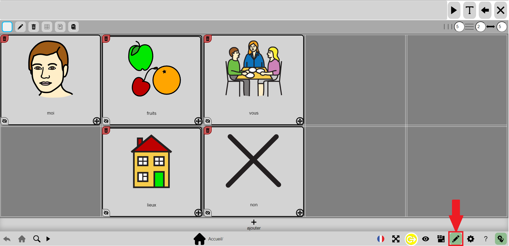
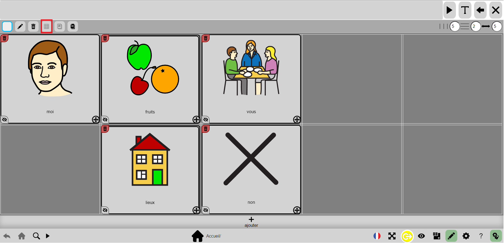

# Grid generation tutorial

## 1) Unlock options

Start by unlocking the options by clicking on the nut with a lock.

## 2) Activate the editing mode

Next, you need to activate the edit mode to bring up the Generate Grid button.

## 3) Press the grid generation button

Press the grid generation button at the top of the screen.

## 4) Fill in the fields

Once in the grid generation menu, you have to fill in all the fields according to what you want to have in your grid.

## Possible error messages
During this step, it is possible to have several errors. The error message that will appear corresponds to the first error encountered, so once you have corrected it, if there are others, they will appear each time you press the "Generate" button.

For each of the fields, you can with errors, here are some :
- "No name for the grid! -> here you have to fill in the first field which gives the name to the grid
- "No columns" -> here you have to fill in the second field, indicate a number for the number of columns
- "No lines" -> here you have to fill in the third field, indicate a number for the number of lines
- "Empty word list" -> here you have to fill in the fourth field, indicating words separated by a space for the list example: "apple banana"

## Result

