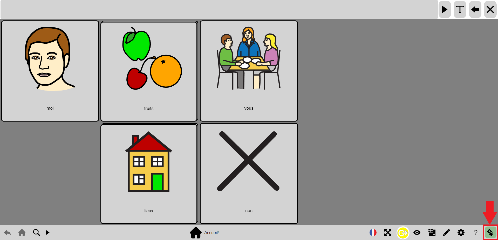
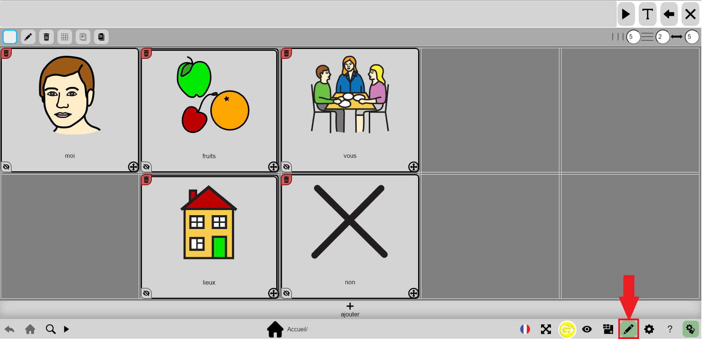
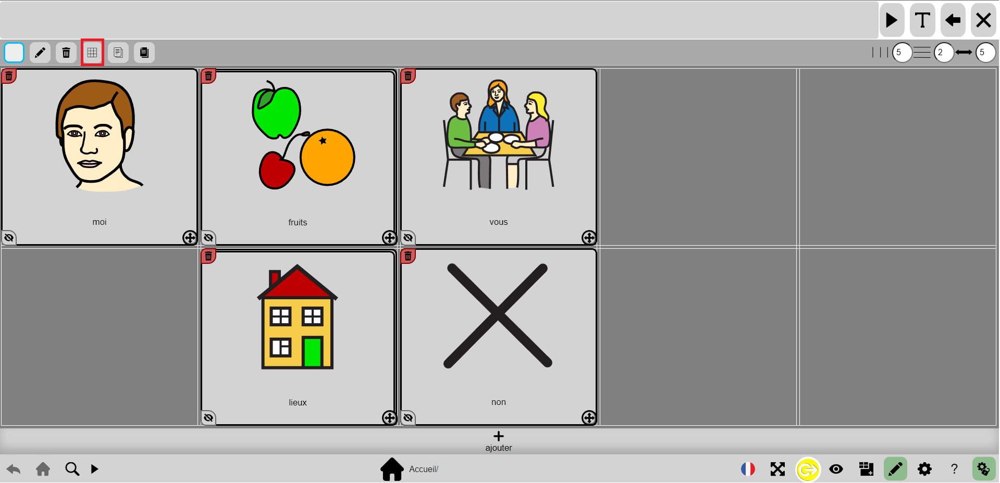
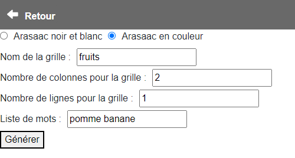
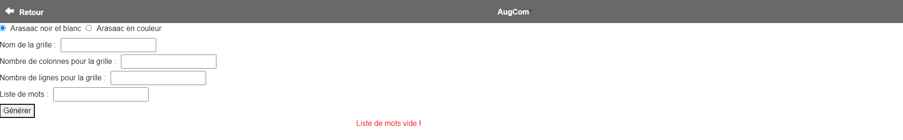
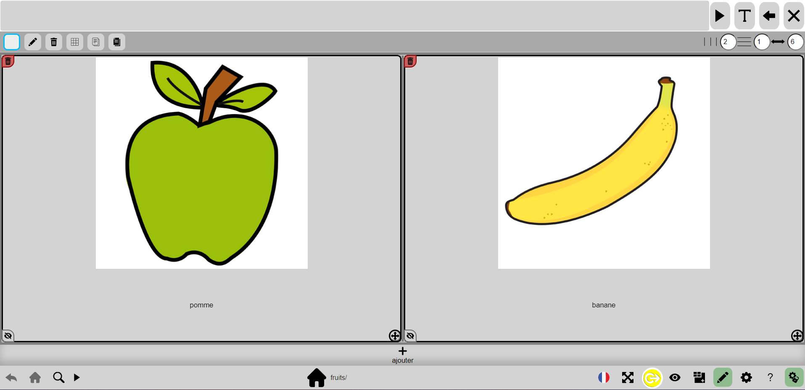

# Tutoriel génération de grille

## 1) Déverrouiller les options

Commencez par déverrouiller les options en cliquant sur l'écrou avec un verrou.

## 2) Activer le mode édition

Ensuite, vous devez activer le mode édition pour faire apparaître le bouton de Génération de grille.

## 3) Appuyer sur le bouton de génération de grilles

Appuyez sur le bouton de génération de grilles en haut de l'écran.

## 4) Remplir les champs

Une fois dans le menu de génération de grilles, il faut remplir tous les champs selon ce que vous voulez avoir dans votre grille.

## Messages d'erreur possible
Durant cette étape, il est possible d'avoir plusieurs erreurs. Le message d'erreur qui va s'afficher correspond à la première erreur rencontrée donc une fois que vous l'aurez corrigé s'il y a en d'autres, elles apparaîtront à chaque fois que vous appuierez sur le bouton "Générer".

Pour chacun des champs, vous pouvez avec des erreurs, voici lesquels :
- "Pas de nom pour la grille!" -> ici il vous faut remplir le premier champs qui donne le nom à la grille
- "Pas de colonnes" -> ici il vous faut remplir le deuxième champs, indiqué un chiffre ou un nombre pour le nombre de colonne
- "Pas de lignes" -> ici il vous faut remplir le troisième champs, indiqué un chiffre ou un nombre pour le nombre de ligne
- "Liste de mots vide" -> ici il vous faut remplir le quatrième champs, indiqué des mots séparé par un espace pour la liste exemple : "pomme banane"

## Résultat

